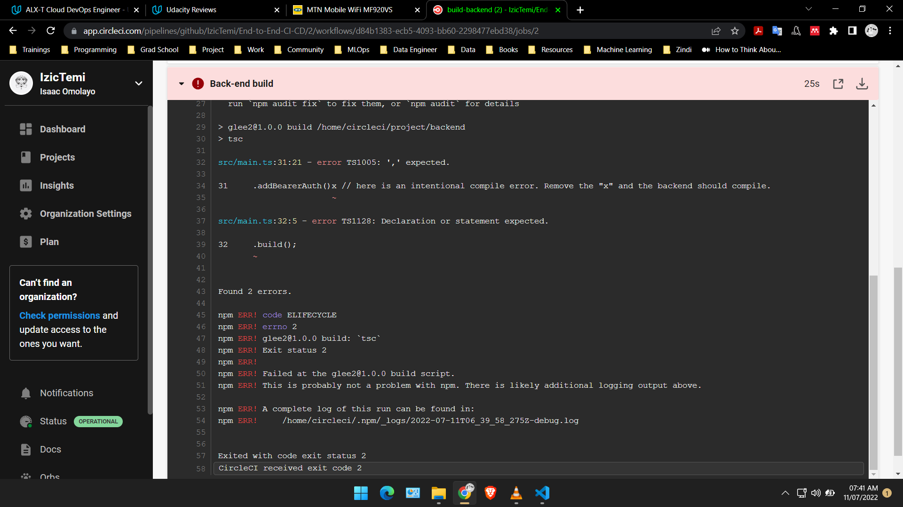
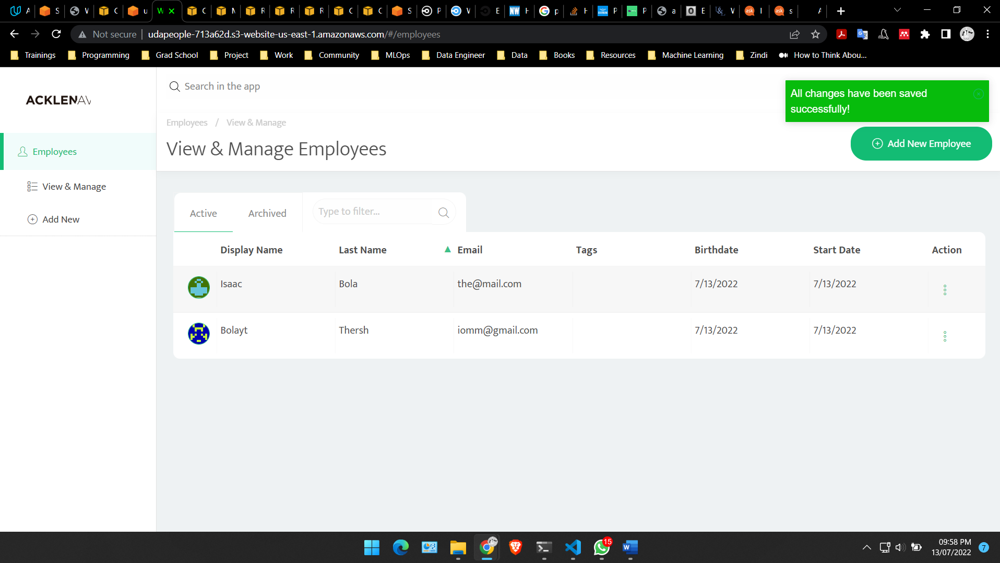
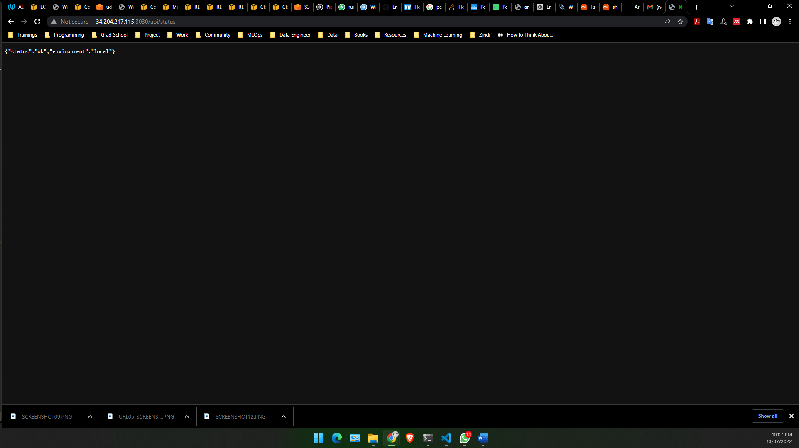

# Give an Application Auto-Deploy Superpowers

In this project, I was given a starter code for a fictional company 'UdaPeople' - a revolutionary concept in Human Resources which promises to help small businesses care better for their most valuable resource: their people. The project aims to develop a CI/CD pipeline; complete with monitoring and logging to automate deploying the stack. I aim to accomplist the following objectives:

- Utilize Deployment Strategies to design and build CI/CD pipelines that support Continuous Delivery processes.
- Utilize a configuration management tool to accomplish deployment to cloud-based servers.
- Surface critical server errors for diagnosis using centralized structured logging.


## Built With

- [Circle CI](www.circleci.com) - Cloud-based CI/CD service
- [Amazon AWS](https://aws.amazon.com/) - Cloud services
- [AWS CLI](https://aws.amazon.com/cli/) - Command-line tool for AWS
- [CloudFormation](https://aws.amazon.com/cloudformation/) - Infrastructure as Code
- [Ansible](https://www.ansible.com/) - Configuration management tool
- [Prometheus](https://prometheus.io/) - Monitoring tool

## Section 1 - Getting Started

Instructions for how to get a copy of the project running on your local machine.

### Dependencies

* Git SCM
* SSH client like OpenSSH
* NodeJs v10 or higher (if you plan on compiling locally)

### Starting Out

1. Clone the repo to your machine so that you can manipulate the files.
2. Push your code into a repository in your account in Github. You might consider making your repository public so that Circle CI will give you more credits to run builds ([more information here](https://circleci.com/open-source/)).

### Compiling/Running Locally (Optional)

**PLEASE NOTE:** It is NOT necessary that you compile and run the project locally. 

The instructions and information that follows should help you build, test and deploy the web application either locally or in CI/CD.

This is a "mono-repository" which means multiple servers or layers exist in the same repository. You'll find the following main folders:

- `./frontend`
- `./backend`

#### 1. Install dependencies in both `frontend` and `backend` folders.

From your base folder, use the commands:
```bash
cd frontend
npm i
```
From your base folder, use the commands:
```bash
cd backend
npm i
```

#### 2. Create `.env` file for database connection info.

Add a `.env` file to the `backend` folder with the following contents:

```bash
NODE_ENV=local
VERSION=1
TYPEORM_CONNECTION=postgres
TYPEORM_MIGRATIONS_DIR=./src/migrations
TYPEORM_ENTITIES=./src/modules/domain/**/*.entity.ts
TYPEORM_MIGRATIONS=./src/migrations/*.ts

# Things you can change if you wish...
TYPEORM_HOST=localhost
TYPEORM_PORT=5532
TYPEORM_USERNAME=postgres
TYPEORM_PASSWORD=password
TYPEORM_DATABASE=glee
```

You can use your own Postgres server if you wish or you can use the Docker-Compose template provided in the `./utils` folder.

## Running PostgreSQL in Docker-Compose

For convenience, a template that you can use to easily run a Postgres database for local testing. To run this template, you'll need to install Docker and Docker-Compose.

To start the database, you will use the following commands from your base folder:
```bash
cd util
docker-compose up
```

## Compiling the Code

You can compile the code from your base folder using the following:
```bash
cd frontend
npm run build
```

```bash
cd backend
npm run build
```

## Testing, Migrating, Running

Most of the tasks needed to build, test and deploy the application are simplified by "npm scripts" that are found in the `package.json` for either front-end or back-end. For any of these scripts, you will need to `cd` into the respective folder and then run the script using the command `npm run [script name]`. Here are the most relevant scripts:

| Name | Purpose | Notes | 
| :-- | :-- | :-- |
| migrations | Run migration which checks for any migration scripts that have not yet been applied to the db and runs them. |Make sure you have a Postgres database running and the `.env` file is configured correctly. If you get connection errors from the backend when you start it, then chances are the DB is not running or the `.env` doesn't have the correct DB connection information. |
| migrations:revert | Revert last successfully executed migration. | The same connection configuration is needed here as with the `migrations` script above. |
| test | Run all unit tests. | |
| build | Compiles the code. | Drops the compiled code in the `./dist` folder. |
| start | Starts up the application locally. | Make sure you have a Postgres database running and the `.env` file is configured correctly. If you get connection errors from the backend when you start it, then chances are the DB is not running or the `.env` doesn't have the correct DB connection information.|

### Examples:

This should compile the code and then list the result in the `./dist` folder:

```bash
cd frontend
npm run build
cd dist
ls
```

... or revert the last migration that ran:

```bash
cd backend
npm run migrations:revert
```

## Section 2 - Utilize Deployment Strategies to Design and Build CI/CD Pipelines that Support Continuous Delivery Processes

### Circle CI

Circle CI is only one of many options for CI/CD tools. It is a “software as a service” and has a [free account](https://circleci.com/signup/?source-button=free) that you can use throughout this project, which is ideal for 'UdaPeople' since it’s a start-up running on a shoestring budget!

1. [Create an account](https://circleci.com/signup/?source-button=free) with circleci.com if you haven't already. I recommend the free tier. It includes 2500 credits per week which equals around 70 builds. This should be enough as long as you are conservative with your builds. _If you run out of credits, you can create another account and continue working._
2. Create a new project in Circle CI using your GitHub repo.
 - Notice the `.circleci` folder. This is where jobs will go.
3. Ensure a workflow starts with the jobs in the `.config` file. If you need to take a look at some samples, Circle CI was nice enough to [give us a few](https://circleci.com/docs/2.0/sample-config).

### To Do

- Make sure commits/pushes to repo trigger the CI/CD pipeline (this should be automatic after connecting CircleCI to your Github repo).

#### 1. Build Phase

The goal of a build phase is to compile or lint the source code to check for syntax errors or unintentional typos in code. It’s the first line of defense against bugs as we attempt to integrate the pieces of the project together.

- A job named `build-frontend` in the `.circleci/config.yml` file. 
- Another job named `build-backend` in the `.circleci/config.yml` file. 
- Notice that both jobs have selected a Docker image that is compatible with NodeJS.
```
 - image: circleci/node:13.8.0
```
- Throughout this project, there'll be separate jobs for the front-end and back-end so that failure alerts are more descriptive.
- Jobs should fail if code cannot be compiled (fail for the right reasons), and **a failed build should stop all future jobs.** 



#### 2. Test Phase

Unit tests are one of the many very important building blocks of a system that enables Continuous Delivery. So, if a test fails, it's because the code is no longer trustworthy. Only trustworthy code should get a ticket to continue the ride!

- Create jobs named `test-frontend` and `test-backend` in the config file. 
- A unit test job should fail the job and prevent any future jobs from running.


#### 3. Analyze Phase

Included is a job that checks for known vulnerabilities every time we check in new code.

- Create jobs named `scan-frontend` and `scan-backend` in the config file. 
    - Use `npm` to “audit” the code to check for known package vulnerabilities. Just `cd` into the directory of front-end and back-end and run the following:
```bash
npm audit --audit-level=critical
```
- Job should fail if any major vulnerabilities are found (fail for the right reasons).


- Fix the vulnerability using the command below and re-run the job.
```bash
npm audit fix --audit-level=critical --force
```
- A failed analysis should stop all future jobs.

#### 4. Alerts

When a build fails for any reason, an alert should be sent out. We’re going to add an alert so that botched builds raise a nice wavy red flag.

- Integrate Slack, email or another communication tool to receive alerts when jobs fail. Our examples are using Slack, but you should feel free to use the communication tool to which you are most accustomed.
- Alerts should include a summary of what happened and a link to the job console output for quick troubleshooting.


## Section 3 - Utilize a Configuration Management Tool to Accomplish Deployment to Cloud-Based Servers

In this section, we'll be creating and configuring infrastructure before deploying code to it. This will be accomplished by preparing your AWS and CircleCI accounts just a bit, then by building Ansible Playbooks for use in the CircleCI configuration.

### Setup

#### AWS
1. Create and download a new key pair in AWS for CircleCI to use to work with AWS resources. Name this key pair "udacity" so that it works with the CloudFormation templates. [This tutorial may help](https://docs.aws.amazon.com/AWSEC2/latest/UserGuide/ec2-key-pairs.html#having-ec2-create-your-key-pair) (look for "Option 1: Create a key pair using Amazon EC2"). We'll be using this key pair (pem file) in future steps so keep it in a memorable location. 
2. Create IAM user for programmatic access only and copy the id and access keys. [This tutorial may help.](https://serverless-stack.com/chapters/create-an-iam-user.html) You'll need these keys if you want to try any AWS commands from your own command line. You'll also need these credentials to add to CircleCI configuration in the next steps.
3. Add a PostgreSQL database in RDS that has **public accessibility**. Take note of the connection details (hostname, username, password). [This tutorial may help.](https://aws.amazon.com/getting-started/tutorials/create-connect-postgresql-db/) As long as you marked "Public Accessibility" as "yes", you won't need to worry about VPC settings or security groups.


### CloudFront Distribution Primer

At the very end of the pipeline, we will need to make a switch from the old infrastructure to the new using the Blue Green Deployment strategy. We will use CloudFormation and CloudFront to accomplish this. However, for this to work, you must do a few things manually:

1) Create an S3 Bucket with a unique name by appending a random string to `udapeople-` (e.g. "udapeople-kk1j287dhjppmz437"). The random string is to distinguish the bucket.
2) Run the provided [CloudFormation](https://github.com/udacity/cdond-c3-projectstarter/blob/master/.circleci/files/cloudfront.yml) template locally (for the Workflow ID parameter, use your randomm string).

Once that is done, subsequent executions of that template will modify the same CloudFront distribution to make the blue-to-green switch without fail.

#### Circle CI

Please watch the [video walkthrough of setting up secrets here](https://www.youtube.com/watch?v=caFJQ1YwVdU).

1. Add SSH Key pair from EC2 as shown [here](https://circleci.com/docs/2.0/add-ssh-key/). To get the actual key pair, you'll need to open the pem file in a text editor and copy the contents. Then you can paste them into Circle CI.

2. Add the following environment variables to the Circle CI project by navigating to {project name} > Settings > Environment Variables as shown [here](https://circleci.com/docs/2.0/settings/):
  - `AWS_ACCESS_KEY_ID`=(from IAM user with programmatic access)
  - `AWS_SECRET_ACCESS_KEY`= (from IAM user with programmatic access)
  - `AWS_DEFAULT_REGION`=(your default region in aws)
  - `TYPEORM_CONNECTION`=`postgres`
  - `TYPEORM_MIGRATIONS_DIR`=`./src/migrations`
  - `TYPEORM_ENTITIES`=`./src/modules/domain/**/*.entity.ts`
  - `TYPEORM_MIGRATIONS`=`./src/migrations/*.ts`
  - `TYPEORM_HOST`={your postgres database hostname in RDS}
  - `TYPEORM_PORT`=`5532` (or the port from RDS if it’s different)
  - `TYPEORM_USERNAME`={your postgres database username in RDS}
  - `TYPEORM_PASSWORD`={your postgres database password in RDS}
  - `TYPEORM_DATABASE`={your postgres database name in RDS}

_NOTE:_ Some AWS-related jobs may take awhile to complete. If a job takes too long, it could cause a timeout. If this is the case, just restart the job and keep your fingers crossed for faster network traffic. If this happens often, you might consider increasing the job timeout [as described here](https://support.circleci.com/hc/en-us/articles/360007188574-Build-has-hit-timeout-limit).

#### 1. Infrastructure Phase

Setting up servers and infrastructure is complicated business. Hence, we'll be using an IaC (“Infrastructure as Code”) - CloudFormation. 

In this phase, we will add CircleCI jobs that execute Cloud Formation templates that create infrastructure as well as jobs that execute Ansible Playbooks to configure that newly created infrastructure.

##### Create/Deploy Infrastructure

- Create a job named `deploy-infrastructure` in the config file
  - Add code to create the infrastructure using [CloudFormation templates](https://github.com/udacity/cdond-c3-projectstarter/tree/master/.circleci/files). 
  

  - Create backend infrastructure
    - Use the workflow id to mark CloudFormation stacks so that they can be referenced later on (ex: rollback). If you'd like, you can use the parameterized CloudFormation templates we provided. 
    - Programmatically create a new EC2 Instance for the back-end.
    - Make sure the EC2 instance has the back-end port opened up to public traffic (default port 3030).
    - Programmatically save the new back-end url to memory or disk for later use (the front-end needs it). This could be done with [MemStash.io](https://memstash.io).
    - Tag the back-end infrastructure so that it can be referenced later.
    
  - Create frontend by editing the step named `Ensure front-end infrastructure exist`.
    - Use a CloudFormation template to create a new S3 Bucket for the front-end.
    - Use the workflow id to mark the front-end infrastructure so that you can reference it easily later on.
    - Tag the front-end infrastructure so that it can be referenced later.
  - Generate an inventory file for use with Ansible by using AWS CLI to append the newly created backend IP to the [provided](https://github.com/udacity/cdond-c3-projectstarter/blob/master/.circleci/ansible/inventory.txt) inventory file.
    - Persist the modified inventory file to the workspace so that we can use that file in future jobs.
  
##### Configure Infrastructure

- Create a job named `configure-infrastructure` in the config file.
  - Write code to set up the EC2 intance to run as our back-end.
    - Add the SSH key fingerprint to job so that Ansible will have access to the EC2 instance via SSH.
    - Attach the "workspace" to the job so that you have access to all the files you need (e.g. inventory file).
    - Create an Ansible playbook named `configure-server.yml` in the `.circleci/ansible` folder to set up the backend server. Remember that you are running this Playbook against an EC2 instance that has been programmatically created (inside the CircleCI job). 
      - Use username `ubuntu`.  
      - Keep your playbook clean and maintainable by using roles. You will need to decide what roles to create and how to split up your code.
      - Install Python, if needed.
      - Update/upgrade packages.
      - Install nodejs.
      - Install pm2.
      - Configure environment variables (use the `environment` module type in your role):
        - `ENVIRONMENT`=`production`
        - `TYPEORM_CONNECTION`=`postgres`
        - `TYPEORM_ENTITIES`=`./modules/domain/**/*.entity{.ts,.js}`
        - `TYPEORM_HOST`={your postgres database hostname in RDS}
        - `TYPEORM_PORT`=`5532` (or the port from RDS if it’s different)
        - `TYPEORM_USERNAME`={your postgres database username in RDS}
        - `TYPEORM_PASSWORD`={your postgres database password in RDS}
        - `TYPEORM_DATABASE`={your postgres database name in RDS}
      - Install and [Configure PM2](https://www.digitalocean.com/community/tutorials/how-to-use-pm2-to-setup-a-node-js-production-environment-on-an-ubuntu-vps) to run back-end server.

#### 2. Deploy Phase

Now that the infrastructure is up and running, it’s time to configure for dependencies and move our application files over. We'll add a job that handles this automatically using Ansible.

##### Database migrations

- Create a job named `run-migrations` in the config file.
  - Write code that runs database migrations so that new changes are applied. 
    - Save some evidence that any new migrations ran. This is useful information if you need to roll back. Hint: The migration output will include `"has been executed successfully"` if any new migrations were applied.
      - Save the output to a file or variable.
      - Use `grep` to check for text that shows that a new migration was applied.
      - If true, send a "1" (or any value at all) to [MemStash.io](https://memstash.io) using a key that is bound to the workflow id like `migration_${CIRCLE_WORKFLOW_ID}`.

##### Deploy Front-end

- Create a job named `deploy-frontend` in the config file.
  - Write code to prepare the front-end code for distribution and deploy it. 
    - Install any additional dependencies
    - Add the url of the newly created back-end server to the `API_URL` environment variable. This is important to be done before building the front-end in the next step because the build process will take the `API_URL` from the environment and "bake it" (hard-code it) into the front-end code.
      - In a previous job, you created the back-end infrastructure and saved the IP address of the new EC2 instance. This is the IP address you will want to pull out and use here. If the IP address is "1.2.3.4", then the `API_URL` should be `https://1.2.3.4:3000`.
    - Run `npm run build` one last time so that the back-end url gets "baked" into the front-end. 
    - Copy the files to the new S3 Bucket using AWS CLI (compiled front-end files can be found in a folder called `./dist`).

##### Deploy Back-end

- Create a job named `deploy-backend` in the config file.
  - Create code to deploy the compiled backend files to the EC2 instance. 
    - Add the SSH key fingerprint to the job.
    - Attach the "workspace" so that you have access to the previously generated `inventory.txt`.
    - Install any necessary dependencies.
    - Use Ansible to copy the files (compiled back-end files can be found in a folder called `./dist`).

#### 3. Smoke Test Phase

Create a smoke test to remove ensure that nothing we didn’t plan for that made it through to production
- Create a job named `smoke-test` in the config file.
  - Write code to make a simple test on both front-end and back-end. Use the suggested tests below or come up with your own. 
    - Install dependencies like `curl`.
    - Test the back-end
      - Retrieve the back-end IP address that you saved in an earlier job.
      - Use `curl` to hit the back-end API's status endpoint (e.g. https://1.2.3.4:3000/api/status)
      - No errors mean a successful test
    - Test the front-end
      - Form the front-end url using the workflow id and your AWS region like this: `URL="http://udapeople-${CIRCLE_WORKFLOW_ID}.s3-website-us-east-1.amazonaws.com"` 
      - Check the front-end to make sure it includes a word or two that proves it is working properly.
      - No errors mean a successful test
      ```bash
      if curl -s ${URL} | grep "Welcome"
      then
        return 1
      else
        return 0
      fi
      ```


#### 4. Rollback Phase

If the smoke test fails, create a job that rolls back to previously working infrastructure.

- At the top of the config file, create a “[command](https://circleci.com/docs/2.0/reusing-config/#authoring-reusable-commands)” named `destroy-environment` to remove infrastructure if something goes wrong
  - Trigger rollback jobs if the smoke tests or any following jobs fail. 
  - Delete files uploaded to S3.
  - Destroy the current CloudFormation stacks using the same stack names you used when creating the stack earlier (front-end and back-end).
- At the top of the config file, create a “[command](https://circleci.com/docs/2.0/reusing-config/#authoring-reusable-commands)” named `revert-migrations` to roll back any migrations that were successfully applied during this CI/CD workflow
  - Trigger rollback jobs if the smoke tests or any following jobs fail. 
  - Revert the last migration (IF a new migration was applied) on the database to that it goes back to the way it was before. You can use that value you saved in [MemStash.io](https://memstash.io) to know if you should revert any migrations.
- No more jobs should run after these commands have executed.


- Add these rollback commands to other jobs that might fail and need a rollback.

#### 5. Promotion Phase

Assuming the smoke test came back clean, we would have a relatively high level of confidence that our deployment was a 99% success. Since we use the “Blue-Green Deployment Strategy”, now that we’re sure everything is "A-okay", we can switch from blue to green. 

- Create a job named `cloudfront-update` in the config file.
  - Create code that promotes our new front-end to production.
    - Install any needed dependencies
    - Use a [CloudFormation template](https://github.com/udacity/cdond-c3-projectstarter/tree/master/.circleci/files) to change the origin of the CloudFront distribution to the new S3 bucket.


- Public URL for CloudFront distribution (aka, production front-end).



- Public URL for back-end server in EC2. 



#### 6. Cleanup Phase

Clean up old stacks after switching from blue to green deployments.

- Create a job named `cleanup` in the config file.
  - Write code that deletes the previous S3 bucket and EC2 instance. 
    - Query CloudFormation to find out the old stack's workflow id like this:
    ```
    export OldWorkflowID=$(aws cloudformation \
          list-exports --query "Exports[?Name==\`WorkflowID\`].Value" \
          --no-paginate --output text)
      export STACKS=($(aws cloudformation list-stacks --query "StackSummaries[*].StackName" \
          --stack-status-filter CREATE_COMPLETE --no-paginate --output text)) 
    ```
    - Remove old stacks/files
      - Back-end stack (example: `aws cloudformation delete-stack --stack-name "udapeople-backend-${OldWorkflowID}"`)
      - Front-end files in S3 (example: `aws s3 rm "s3://udapeople-${OldWorkflowID}" --recursive`)
      - Front-end stack


## Section 4 - Surface Critical Server Errors for Diagnosis Using Centralized Logging

We use Prometheus as a monitoring solution since it is open-source and versatile. Once configured properly, Prometheus will turn the server’s errors into sirens that no one can ignore.  

### Setup

Please watch the [video walkthrough of how to set up an EC2 instance and Prometheus here](https://www.youtube.com/watch?v=PSXrbE54FqQ).

- Manually create an EC2 instance and SSH into it.
- Set up Prometheus Server on EC2 following [these instructions](https://codewizardly.com/prometheus-on-aws-ec2-part1/).
- Configure Prometheus for AWS Service Discovery following [these instructions](https://codewizardly.com/prometheus-on-aws-ec2-part3/).

#### 1. Setup Back-End Monitoring

In order for server instances to speak to Prometheus, we'll install an “exporter” in each one.  

- Create a job that uses Ansible to go into the EC2 instance and install the exporter.
  - Add a section to the back-end configuration job to install the `node_exporter` for Prometheus monitoring. This should be done using Ansible. Your playbook can simulate the steps in [this tutorial](https://codewizardly.com/prometheus-on-aws-ec2-part2/). 
  - After deploy, ensure the back-end is being discovered by the Prometheus Server.


#### 2. Setup Alerts

Now that Prometheus and the EC2 instance have an open line of communication, we set up some alerts. I'll configure an email alert service.

- SSH into the Prometheus Server.
- Install and configure AlertManager by following [these instructions](https://codewizardly.com/prometheus-on-aws-ec2-part4/).
- To test - set up an alert for low memory or some condition you can control to intentionally cause an alert.


### License

See the [License](LICENSE.md) file for details.
